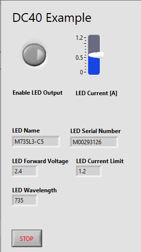
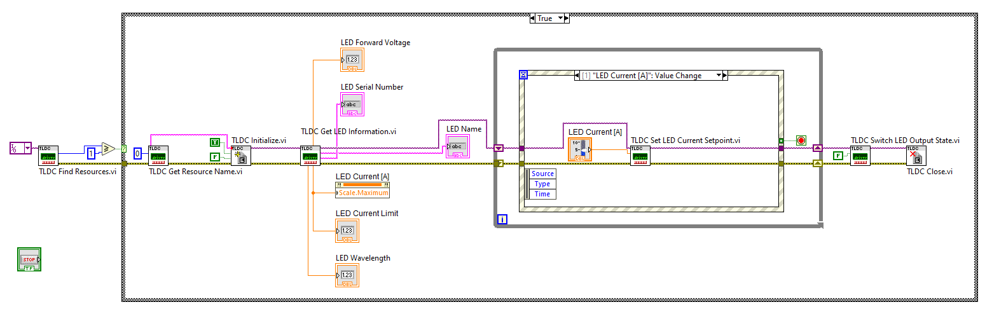

# DC40 Example
Shows how to connect to the DC40, turn on the LED and change current.

Tested with 
Labview 2023 Q3, 64 Bit\
DC40 software version 1.0.0\
Firmware version 1.8.1
 
## Front Panel

## Block Diagram

